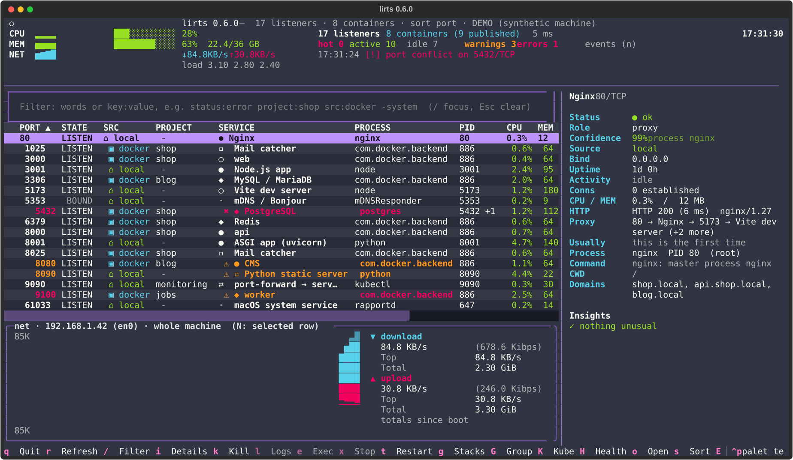
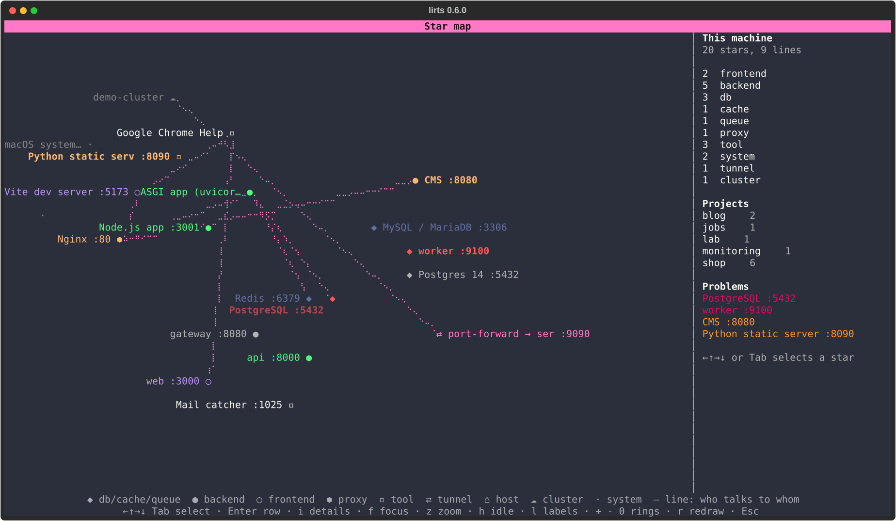
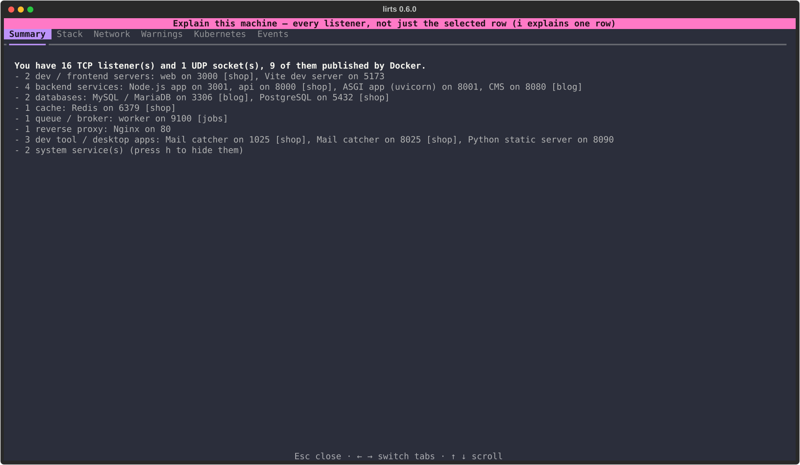
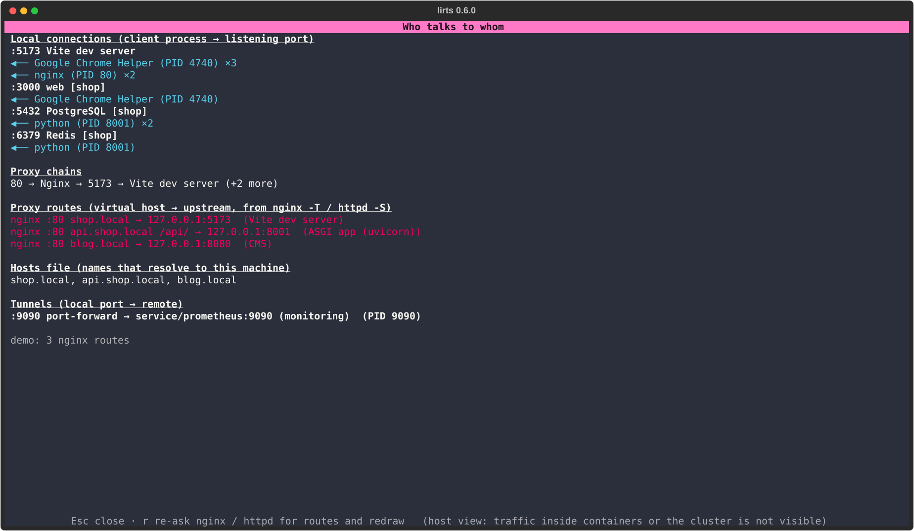
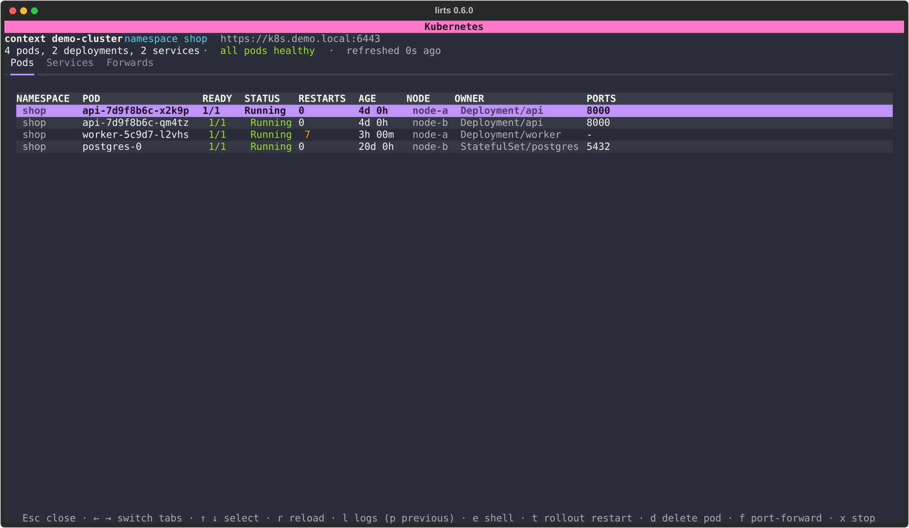
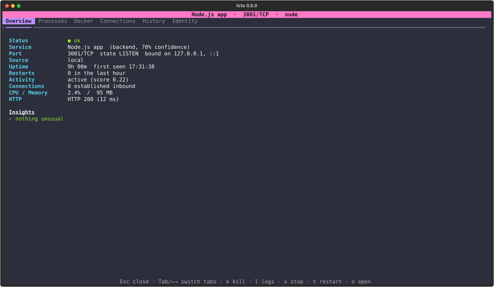
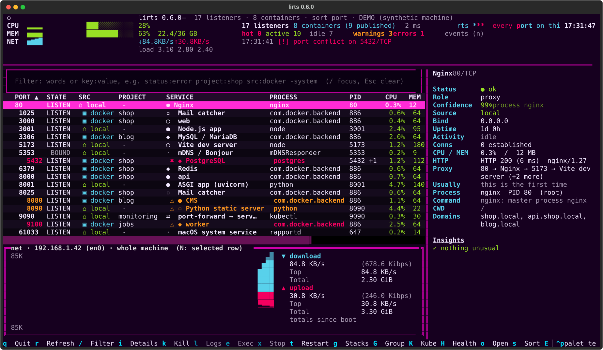

# lirts

**A btop-style terminal dashboard for ports, processes, Docker containers and the services behind them.**

`lirts` answers the question every developer asks a dozen times a day:

> "What is running on my machine, which service is it, is it healthy, and how do I control it?"

It merges what `lsof`, `netstat`/`ss`, `docker ps`, `docker stats` and `btop` know into one
keyboard-driven view, then adds a layer of understanding on top: service identity, project
tagging, health probing, anomaly detection and one-key actions.



The star map (`M`): every service, container, tunnel, host and cluster as a star, lines for
who talks to whom, one wedge per project, remembered across runs.



<details>
<summary>More screens: Explain, who talks to whom, Kubernetes, row details, the cracktro preset</summary>











</details>

All screenshots come from `lirts --demo`, a synthetic machine, so nothing in them is real.

## Why another tool?

Every existing tool shows one slice of the picture:

| Tool | Shows | Missing |
|------|-------|---------|
| `lsof -i`, `ss`, `netstat` | raw sockets and PIDs | what the service is, whether it works, any action |
| `procs`, `htop`, `btop` | processes and system load | ports as first-class rows, containers, services |
| `lazydocker`, `ctop`, `dozzle` | containers, logs, stats | local processes, the host ports they collide with |
| `bandwhich`, `nethogs`, `sniffnet` | per-process traffic | identity, health, control |
| `killport` | frees one port | everything else |

lirts is built around the **port as the unit of work** and puts local processes and containers
in the same table. On top of the raw data it adds what none of the above do:

- **Identity**: `node 3000` becomes "Vite dev server (frontend, project shop, 95 %)", with the
  reasoning shown.
- **Health and anomalies**: HTTP probes, container health, crash loops, stale dev servers and,
  most usefully, **port conflicts between a local service and a container** on the same port.
- **Consequences before actions**: a blast-radius preview before any kill, and whole-stack
  restart / stop / logs.
- **Memory**: history, events, remembered patterns (which port keeps conflicting, what keeps
  being restarted or killed, over 30 days), "explain my machine", changes since the last
  session and the learned star map, so the tool answers "what changed?", not only "what is
  running?".

If you only need one of the slices, the specialised tool is lighter. lirts is for the moment you
have five projects, three of them in Docker, and something on port 5432 is not what you think.

```
 CPU ▁▂▃▅▃▂▁▂ ████░░░░░░░░  29%        31 listeners  19 containers (17 published)  64 ms
 MEM ▁▁▁▁▁▁▁▁ ████████░░░░  69%        hot 2  active 1  idle 28   warnings 0  errors 2
 NET ▂▃▅▇▅▃▂▁ ↓ 1.5 KB/s ↑ 0 B/s       01:04:09 [!] port conflict on 5432/TCP

 PORT  STATE   SRC     SERVICE            PROCESS              PID      CPU    MEM  CONN  ACTIVITY   UPTIME  STATUS
 3000  LISTEN  docker  website            com.docker.backend   886      0.3   30 MB    0  ··· idle   1h 06m  ● ok
 5173  LISTEN  docker  frontend           com.docker.backend   886      0.4   54 MB    0  ··· idle   1d 2h   ● ok
 5178  LISTEN  local   Vite dev server    node                 50973    0.1   64 MB    0  ··· idle   32m     ● ok
 5432  LISTEN  docker  PostgreSQL         postgres             850 +1  28.6  1.8 GB    0  ▮▮▮ hot    13h     ● error
 6379  LISTEN  docker  Redis              redis-server         842 +1  17.7  104 MB    0  ▮▮▮ hot    13h     ● error
 8080  LISTEN  local   Apache httpd       httpd                851 +8   0.1   28 MB    0  ··· idle   1d 2h   ● ok
```

## Highlights

- **Unified view**: local listeners and Docker-published ports side by side, including
  ports Docker publishes through NAT that `psutil` cannot see.
- **Service identity engine**: "node 3000" becomes "Vite dev server (frontend, 95%)" using
  process names, command lines, container images, compose services, HTTP headers and
  well-known ports, with the reasoning shown in the details view.
- **Project auto-tagging**: `~/Development/shop/…` becomes `shop`; compose projects are used
  for containers.
- **Health on demand**: `H` checks the visible rows once and opens a results screen: a TCP
  connect with latency for every listener and, for HTTP services, a health endpoint (`/health`,
  `/healthz`, `/readyz`, … tried once, the one that answers is remembered; per-port overrides in
  the config). Every row says what passed, what failed and why there is no endpoint result.
  Failures become row problems; `lirts health` does the same for scripts with a non-zero exit
  code. There is no background health checking. Container health as reported by Docker, restart
  counts and crash-loop detection come from the data lirts already collects.
- **Problems stand out**: rows with an error are bold red with ✖, warnings bold yellow with ⚠,
  services started in the last few minutes are cyan with ✚, a service that just stopped stays
  as a dimmed `STOPPED` row for a few minutes, and `!` shows problems only.
- **Anomalies and fixes**: port conflicts (also local-vs-Docker on the same port), zombies,
  stale dev servers, unreachable web services, 5xx, slow responses, CPU / memory thresholds,
  each with a suggested action.
- **Blast radius before you kill**: dependents, proxies, other ports served by the same
  process and shared dependencies are listed before anything is terminated.
- **Docker control**: logs (with follow), real interactive `docker exec` shells, stop / restart,
  environment variables (secrets masked), volumes, per-container CPU / memory / network with
  totals since the container started and a history; the stacks screen sums traffic per stack
  and names the chattiest container.
- **Traffic panel**: a btop-style net box under the table with your own address, download drawn
  up from the midline and upload down, current / top / total for each direction. Whole machine
  by default; `N` switches it to the row under the cursor (a process or a container). Off in
  Settings if you do not want it, and then nothing is computed for it.
- **History**: sparklines for CPU, connections, latency and traffic in / out, activity timeline,
  start / stop / restart events, uptime, all persisted across runs. A restart is counted only when every
  previous PID of the port is gone; a helper process joining or leaving (an updater, a child
  that inherited the socket) is logged as a change, not a restart. Kills and restarts you do
  from lirts are written to the event log too.
- **Explain my machine**: a plain-language summary of what runs, the inferred stack
  (`Vite (frontend) + FastAPI (backend) + PostgreSQL + Redis, fronted by Nginx`), what needs
  attention, and what changed since the last session.
- **Who talks to whom**: established loopback connections are joined into a map of client
  process → listening port (`w`, `lirts graph`), shown per row as "Clients", and used in the
  blast radius ("3 local client processes will lose their connection"). Open SSH sessions and
  tunnels are listed alongside.
- **Where was this started from?** Each local process shows its launching shell, terminal
  app (iTerm2, Ghostty, VS Code, …), tty, tmux window and the git branch of its working
  directory, so "which terminal is this dev server running in?" has an answer.
- **Kubernetes, generically**: with `kubectl` and a current context, `K` opens pods, services
  and port-forwards for that context and namespace with logs, shell, rollout restart and
  one-key port-forwards; `kubectl port-forward` and `ssh -L` tunnels on the machine are
  identified as rows ("port-forward → service/postgres:5432 (dev)") and warned about when
  their target disappears. Nothing is hard-coded and the kubeconfig is never modified.
- **Scriptable**: `lirts list --json`, `lirts kill 3000`, `lirts explain`.

## Installation

Requires Python 3.11+ on macOS or Linux.  Docker integration is optional and detected at runtime.

```bash
pipx install .            # from a checkout; or: pip install .
lirts                     # launch the dashboard
pipx inject lirts mcp     # optional: the MCP server for coding agents (pip: pip install '.[mcp]')
```

One-liner without a checkout (installs pipx if needed):

```bash
curl -fsSL https://raw.githubusercontent.com/EvilUnicornLabs/lirts/master/install.sh | sh
```

Shell completion for bash, zsh or fish:

```bash
lirts --install-completion
```

Homebrew: a formula lives in [packaging/homebrew/lirts.rb](packaging/homebrew/lirts.rb); once a
release tag exists, fill in the tarball checksum, run `brew update-python-resources` and publish it
in a tap (`brew tap <you>/lirts && brew install lirts`). GitHub Actions in `.github/workflows`
run the checks on macOS and Linux and build the sdist and wheel for tagged releases.

For development:

```bash
make dev                  # venv + editable install + dev tools
make run                  # or: venv/bin/lirts
make check                # ruff + mypy + pytest
```

`python3 main.py` still works as before.

### Permissions

`lirts` runs as a normal user.  Processes owned by other users (system daemons) show a
name and PID but not their command line or memory; run with `sudo` to see everything.

## Usage

```
lirts                       # dashboard (same as `lirts tui`)
lirts --udp --hide-system   # start with UDP sockets shown and OS daemons hidden
lirts --no-docker --no-probe --refresh 5

lirts list                  # one-shot table
lirts list --json           # machine-readable, for scripts
lirts list -f "docker shop" # rows matching every word
lirts list -p 5432 --json   # a single port with all details

lirts kill 3000             # shows the blast radius, asks, sends SIGTERM
lirts kill 3000 -9 -y       # SIGKILL without asking
lirts restart 3000          # container: docker restart; local: kill and re-run its command

lirts stack list            # compose projects, their containers and ports
lirts stack restart shop    # restart / stop / logs for a whole project
lirts stack logs shop -n 50

lirts watch                 # print start / stop / restart / health events as they happen
lirts watch --notify -f shop   # desktop notifications, only for rows matching "shop"

lirts kube pods             # pods of the current context / namespace (-n NS, -A, --context C)
lirts kube services         # services and their ports
lirts kube logs api -p      # logs of a pod (unique prefix is enough); -p previous, -f follow
lirts kube exec api         # shell into a pod
lirts kube restart api      # rollout restart deployment/api (or statefulset/x)
lirts kube forward service/postgres 5435:5432   # background port-forward, tracked by lirts
lirts kube forwards         # list tracked forwards; lirts kube stop 5435 | --all

lirts health                # TCP + health-endpoint check of every listener; exit 1 if any fail
lirts graph                 # who talks to whom: clients per port, proxy chains, tunnels, ssh sessions
lirts reach HOST [PORT]     # DNS, one ping and a TCP connect; exit 1 when not reachable
lirts routes                # virtual hosts of local nginx / httpd and their upstreams
lirts patterns              # recurring issues remembered across runs (--min N, --json, --clear)
lirts doctor                # environment check: Python, config, Docker, kubectl, nettop, notifications

lirts explain               # "explain my machine"

lirts who 3000              # who holds the port, since when, from which project, and what usually runs there
lirts free 3000 [--yes]     # kill the holder (or stop the container) after a confirmation
lirts topology [--json]     # the star map as text: what runs now and what was seen lately; --clear forgets
lirts setup                 # step-by-step settings wizard in the dashboard
lirts config path | show | init | upgrade | set http_probe.interval 30 | themes

lirts mcp                   # serve all of the above to a coding agent over MCP (stdio); --allow-actions adds free / fix / restart

lirts daemon                # one engine for the whole machine, in the foreground (lirts -d); dashboards, commands and agents attach to it
lirts daemon install        # start it at every login (launchd on macOS, systemd on Linux); status | stop | start | uninstall
```

### The daemon: one engine for everything

Without it, every `lirts`, `lirts who` and `lirts mcp` collects on its own and learns on its
own. `lirts daemon` (or `lirts -d`) runs one engine for the whole machine, and from then on
the dashboard, every CLI command and every agent session attach to it instead of starting
their own: one collector, one history, one star map, and the port memory keeps learning all
day even when no dashboard is open. `lirts daemon install` starts it at login; `lirts daemon
status`, `stop`, `start` and `uninstall` manage it; `lirts doctor` shows whether one runs; the
title bar says `via daemon (PID …)` when the dashboard is attached, and `lirts --standalone`
runs an engine of its own anyway.

While nothing is attached the daemon refreshes every `daemon.idle_interval` seconds (10 by
default, `--idle N` overrides it); an attached dashboard drives refreshes at its own
`refresh_interval`. Health checks still run only when asked, from whichever side asks, and
their results are kept in the daemon. Kill, restart, logs and exec happen on the attached
side, which is the same user on the same machine; what must land in the shared memory (a
note in the event log, a routes reload) goes over the socket. The socket lives in the state
directory, readable by your user only.

### For coding agents (MCP)

`lirts mcp` runs a [Model Context Protocol](https://modelcontextprotocol.io) server over stdio,
so an agent such as Claude Code or Cursor can ask lirts instead of guessing from `lsof`: what
is on port 3000, what usually runs there, is it a leftover, who talks to whom, what does the
machine look like. It needs the optional `mcp` SDK (`pip install 'lirts[mcp]'`, or
`pipx inject lirts mcp`); `lirts doctor` says whether it is there.

```bash
claude mcp add --scope user lirts -- lirts mcp   # Claude Code, once, for every repository
```

```json
{ "mcpServers": { "lirts": { "command": "lirts", "args": ["mcp"] } } }
```

Registered at user scope it is available in every project. Then tell the agent when to use
it, once, in your global `~/.claude/CLAUDE.md` (or a project's):

```markdown
## lirts (MCP)
Before starting a dev server, picking a port or debugging "port already in use", ask the
lirts MCP: `who` for the port, `list_listeners` for what runs, `explain` for orientation,
`graph` and `topology` for what talks to what, `health` for a check now. Prefer its answer
over lsof / ps guesses. Never free, fix or restart anything through it without asking me.
```

Each agent session starts its own `lirts mcp` process. With the daemon running (see above)
they all attach to the one engine that has been learning all day; without it each server
holds an engine of its own open, refreshed at `refresh_interval` while the client keeps it
running, and everything stops with the client. Nothing runs when no client started it.

| Tool | Answers |
|---|---|
| `list_listeners(filter?, port?)` | the table as `lirts list --json`, with the dashboard filter syntax |
| `who(port, protocol?)` | holder, project, left over?, what usually runs there, other projects on the port |
| `explain()` | the machine in words (`E`, `lirts explain`) |
| `graph()` | who talks to whom: clients per port, proxy chains, routes, tunnels, ssh (`w`) |
| `topology()` | the learned star map as nodes and relations (`M`, `lirts topology --json`) |
| `events(limit?)`, `patterns()` | recent events; recurring issues remembered across runs |
| `routes()`, `stacks()`, `kube()` | nginx / httpd virtual hosts; compose projects; the cluster as kubectl reports it |
| `health(port?)` | a health check now, of one port or every row; the only way checks run |
| `doctor()` | the environment checks |
| `free_port`, `fix`, `restart` | only with `lirts mcp --allow-actions`; the same paths as `lirts free`, `F` and `t`; refused in replay |

Every tool is read-only unless the server was started with `--allow-actions`, so an agent
cannot stop anything unless you chose that when wiring it up. `--demo` and `--replay FILE`
work here too.

What it looks like in practice:

- **Port already in use.** The agent starts your dev server, gets `EADDRINUSE :3000`, and
  calls `who(3000)`: node, PID 41233, project blog, started 26 hours ago, left over because
  its parent shell is gone, usually shop/web. It tells you that instead of guessing; with
  `--allow-actions` it can call `free_port(3000)` and retry, without it it asks you.
- **Orientation.** "What is running here?" at the start of a session: `explain()` gives the
  stacks, the conflict on 5432, the crash-looping worker and what changed since last time, so
  the agent knows what already exists before it starts anything of its own.
- **Frontend cannot reach the API.** `graph()` shows the nginx routes and who connects to
  what, `list_listeners(port=8001)` whether the backend listens and what the probe saw,
  `health(8001)` runs a check right now, only because it was asked.
- **Before touching a database.** `topology()` shows that the api and the worker talk to
  postgres, so the agent can warn about the blast radius first; `fix(9100)` on the
  crash-looping worker is what `F` does in the dashboard.

## Where things show up

Collection, identity and problem detection run by themselves. Health checks run only when
asked (`H`, or `lirts health`), never in the background. The table, the side panel
(`p`) for the selected row and the details view (`i`) cover most of it:

| Information | Where |
|---|---|
| Identity, role, confidence and the reasons | SERVICE column; side panel; `i` → Identity tab |
| Health (TCP connect, learned health endpoint), on demand with `H` | results screen (per row: TCP latency, endpoint status, Docker health, verdict; `f` failing only, `r` check again, `Enter` filters by the port); afterwards the side panel "Health" line, the optional HEALTH column and red / yellow rows; `lirts health` |
| Where a process was started from (terminal, shell, tmux, branch) | `i` → Processes tab; optional STARTED FROM column (`origin`) |
| Who talks to this port | `i` → Connections tab; `w` for the whole map |
| The constellation: one node per service / container / tunnel / host / cluster, lines for observed relations, grouped by project | `M` map screen; `lirts topology` (text, `--json`) |
| Stack / project | PROJECT column; `g` → stacks |
| Problems and suggestions | ✖ / ⚠ rows; side panel "Insights"; `!` problems only; `n` events with ongoing / recurring; `F` runs the proposed fix |
| The same answers for a coding agent | `lirts mcp`: an MCP server over stdio with `who`, `list_listeners`, `explain`, `graph`, `topology`, `health` and friends; actions only with `--allow-actions` |
| One engine shared by everything, learning all day | `lirts daemon` / `lirts daemon install`; the title bar says `via daemon`; `lirts daemon status`; `lirts doctor` |
| A port that is taken | the row's insights: "usually shop/web, now node (blog)" when another service sits on a port lirts knows, "left over" when the holder's parent is gone or its stack is stopped, "also used by blog/wordpress" when two projects share a port; side panel "Usually" line; `lirts who 3000`, `lirts free 3000`; `F` kills or stops the holder |
| Frontend or backend | the role next to the service name and the row icon (○ frontend, ● backend), from the process command line, the compose service name, the container image and what the HTTP probe sees (a dev server with hot reload, HTML, JSON, an OpenAPI path); a guess below 50 % confidence shows a `?`; `i` → Identity tab lists the reasons |
| Kubernetes | `K` (dimmed in the footer when kubectl is missing); `← →` switch Pods / Services / Forwards, `N` picks a namespace from a list; tunnels appear as rows |
| Recurring issues remembered across runs (conflicts, restarts, kills per port) | `E` → Patterns tab; `n` summary; `i` → History tab of the row; `lirts patterns` |
| Open ssh sessions | rows of the main table: STATE `SSH`, SRC `ssh`, PORT `→22`, SERVICE `⇄ ssh user@host` with `-L/-R/-D` forwards; `k` closes the session; `w` shows them with everything else |
| Settings, version, config file | `,`: tabs General, Layout, Collection, Memory, Insights; `← →` switch tabs; `Enter` on a choice opens a picker (`↑ ↓`, `Enter`, `Esc`) that previews themes live and shows the glyph sets; on/off toggle, numbers and text prompt |

## Keybindings

| Key | Action |
|-----|--------|
| `↑ ↓` `PgUp` `PgDn` | navigate |
| `Enter` / `i` | extended details (tabs: Overview, Processes, Docker, Connections, History, Identity) |
| `/`, `ctrl+f` | filter (`Esc` clears); with the box focused, `/` again switches to command mode: type to narrow the commands (`/F` lists those starting with F), `↑ ↓` move in the dropdown, `Tab` completes, `Enter` runs, `Esc` back to filtering. Filtering: words match anywhere; `key:value` restricts to a field, `-term` negates, e.g. `status:error project:shop src:docker -system`, `port:3000-3999`; keys: port, proto, state, src, project, service, role, process, pid, container, image, activity, status, new |
| `Ctrl+P` | command palette: every action and filter field, searchable by name |
| `s` / `S` | cycle sort column / reverse (or click a column header) |
| `r` | refresh now |
| `Space` / `a` | mark the row / mark all visible rows; `Esc` clears marks. Kill, stop and restart act on marked rows |
| `k` | kill the marked or current process(es), after a blast-radius preview (`t` terminate, `k` kill -9) |
| `l` | container logs (`r` reload, `f` follow) |
| `e` | interactive shell inside the container (lirts suspends; if the shell fails, the error stays on screen until Enter) |
| `x` | stop the marked or current container(s) |
| `F` | fix: run what the row's worst insight proposes (kill the older process of a port conflict, kill a stale dev server or a zombie, restart an unhealthy or stopped container, restart a hung process, open the logs of a crash-looping container), after a confirmation that shows exactly what will run; dimmed when the row has nothing to fix; refused in replay |
| `t` | restart: containers through Docker, local processes by re-running their command in their directory (confirmed first). A local process that used an ephemeral port may come back on a different one; the event log (`n`) says so |
| `G` | group rows under collapsible stack / project headers; on a header `Space`/`Enter` collapses, `x` `t` `l` act on the whole stack |
| `K` | Kubernetes: pods / services / forwards tabs; `l` logs (`p` previous), `e` shell, `t` rollout restart, `d` delete pod, `f` port-forward, `x` stop forward, `N` namespace |
| `Tab` | in the Kubernetes screen: switch tabs (focus follows) |
| `g` | compose stacks: restart, stop, interleaved logs or open the folder of a whole project; `Enter` filters the table by stack |
| `o` / `O` | open in the browser (scheme, hostname and port aware) / open the project folder in your editor (`editor` setting, e.g. `cursor`; empty = file manager) |
| `c` | copy the URL or the `docker exec` command |
| `E` | explain the whole machine, every row, in tabs (`← →`): Summary, Stack, Network (proxies, routes, hosts, connections, ssh), Warnings and recommendations, Changes since last session, Kubernetes, Patterns, Events |
| `!` | show problems only (rows with a warning or an error); press again for everything |
| `H` | check health now: all visible rows, or only the marked ones when any are marked; results screen with a CHECKED time per row |
| `M` | star map: every service, container, tunnel, ssh host and cluster as a star on rings (databases in the centre, external things on the rim), one wedge per project, braille lines for observed relations; a panel with counts, projects and problems. `←↑→↓` / `Tab` select a star (its relations light up, the panel shows them), `Enter` puts the table cursor on its row, `i` opens its details, `f` shows only its project (again for all), `h` hides what is not running, `l` toggles labels, `+` `-` widen or narrow the rings and `0` resets them, `z` zooms into the selected star's wedge (again for the whole map), `r` redraws; the map takes its colours from the active theme; below about 100×30 the same information as a list. The map remembers: a star or line seen before is drawn dim while idle (a line only once it is "usual", seen on three different days), forgotten after 14 days (`topology` settings) |
| `w` | who talks to whom: local client processes per port, proxy chains, tunnels, ssh sessions. With `bandwidth.connections` on, every client → port link shows its rate in / out and a small history |
| `R` | reachability of the ssh host under the cursor: DNS, one ping, TCP connect; inside `K` it checks the API server. On demand only |
| `w` also | proxy routes: the virtual hosts of local nginx / httpd and their upstreams (from `nginx -T` / `httpd -S`, asked once at start, `r` asks again), plus the hosts-file names that point at this machine |
| `n` | notification centre: every start / stop / restart / health event with a legend; `Enter` jumps to the port, `c` clears |
| `u` | toggle UDP sockets |
| `h` | toggle system services |
| `p` | toggle the side panel |
| `N` | traffic panel: whole machine or the selected row (`net_panel` in Settings turns the box off) |
| `T` | cycle the style: `classic` (today's look), `compact` (no borders, dense, side panel folded), `tight` (small paddings, two-row traffic box), `cracktro` (double borders, shaded glyphs, a scroller in the top bar), `phosphor` (ASCII borders, block bars). A style is borders, density, glyphs, scroller and panel set; colours are the theme's business (the `cracktro` and `phosphor` colour themes are in the theme picker) |
| `U` | cycle the layout: `default` (side panel right, traffic then history under the table), `containers` (docker and Kubernetes columns and stack traffic first, cluster summary in the side panel, history box on and first), `hosts` (side panel at the bottom full width with ssh sessions, tunnels, reach results and routes; PROJECT dropped). A layout changes columns, side panel sections, panels and where they go; your saved column list stays |
| `Y` | history panel under the table: cpu, connections, latency, activity and traffic sparklines of the selected row (the same as the details History tab) |
| `,` | settings: lirts version, config file path and whether it is outdated, every option editable in place with live effect, `s` saves |
| `W` | setup wizard: every setting step by step, saved at the end; runs by itself on the first start |
| `?` / `F1` | help |
| `q` | quit |
| `Esc` | clear the filter, then clear marks; with nothing to clear, a small menu: Settings, Help, Star map, Quit, Cancel (`q` still quits directly) |

## Demo and replay (for developers of lirts)

```bash
lirts --demo                       # a synthetic machine: every role, stacks, a crash loop, an unhealthy
                                   # container, a port conflict, ssh sessions, a tunnel, a cluster, routes,
                                   # traffic, and a timeline that makes things happen while you watch
lirts record 5m -o machine.jsonl   # record what lirts sees here, one frame per refresh (--interval 2)
lirts --replay machine.jsonl       # play that back anywhere; actions are disabled, frames loop
lirts list --demo / lirts explain --replay FILE   # the text commands accept both flags too
```

The demo touches nothing on the host: no sockets, Docker, kubectl, commands or state files. In
the demo the api process restarts at 25 s, the admin server stops at 40 s and comes back on
another port at 75 s, a worker container crash-loops every 45 s, mysql turns unhealthy at 30 s,
and an ssh session with a tunnel appears at 12 s; kill, restart and stop act on the pretend
machine. A recording carries everything the dashboard shows, so a file from another machine
looks exactly like sitting at it; the title bar shows `DEMO` or `replay 12/150`.

## Configuration

The config file is watched: edit it in any editor and the dashboard applies the change within a
few seconds. Sort column, direction and grouping are remembered in it too.
On the first start without a config file lirts walks you through the settings step by step
(theme, sources, columns, refresh, grouping, panel, probes, Kubernetes…), arrow keys and Enter,
and saves at the end. `W` reruns that wizard any time, as does `lirts setup`.
For single changes press `,` to see and change every option with immediate effect and `s` to
save. The screen also shows which config file is in use and whether it is outdated.

The config file carries a schema `version`. lirts never rewrites the file by itself: a file
written for an older schema still loads, keys that no longer exist are ignored (they can never
turn a removed feature back on) and the dashboard, the Settings screen and `lirts doctor` say
so, naming the ignored keys. Upgrading is a manual step: press `s` in Settings or run
`lirts config upgrade`.

`lirts config init` writes a commented default file to `~/.config/lirts/config.yaml`
(`$XDG_CONFIG_HOME` and `LIRTS_CONFIG` are honoured; `--config PATH` overrides both).
Every key is optional.  See [config.example.yaml](config.example.yaml) for the full,
annotated reference.  The most useful keys:

| Key | Purpose |
|-----|---------|
| `refresh_interval` | seconds between refreshes (default 2) |
| `sources` | which sources appear: `local`, `docker`, `ssh`, `kubernetes` |
| `net_panel` | the traffic box under the table (default on) |
| `columns` | which columns the table shows, in order |
| `editor` | command that `O` opens the project folder with (`cursor`, `code`, `idea`…); empty = the file manager |
| `aliases` | your own service names, by port or by substring of process / command / container / image |
| `thresholds` | CPU, memory and latency levels for colours and warnings |
| `mask_env_vars` | env var name fragments hidden in the Docker tab |
| `http_probe` | interval, timeout, ports never / always probed |
| `proxies` | `enabled`: ask local nginx / httpd for their virtual hosts at start |
| `docker` | enable, show unpublished containers, stats |
| `bandwidth` | per-process throughput (macOS `nettop`), `auto` or `off`; `connections: true` adds per-connection rates to `w` (one more command per sample: `nettop -t loopback` on macOS, `ss -ti` on Linux), off by default |
| `health` | `timeout`, `paths` tried per HTTP service, per-port `overrides` (checks only run on demand) |
| `kubernetes` | `enabled` (auto / true / false), `context`, `namespace`, `all_namespaces`, refresh `interval`, `timeout` |
| `history` | persistence, window, retention |
| `ui` | looks: `style`, `layout`, `glyphs` (block, braille or demoscene shades for sparklines, bars and row icons), `rounded_corners`, `row_icons` (role icon before the service name, source icon in SRC), `history_panel`, `clock` (strftime for the top bar and event times), `truecolor` (auto, on, off; applied at start). All in Settings under the Layout tab and in the setup wizard |
| `cli` | `force_color`: keep colours when `lirts list` and friends are piped |
| `insights` | stale threshold, restart warning, stopped-row and highlight-new minutes, `pattern_days` / `pattern_min` for the recurring-issue memory |
| `daemon` | `idle_interval`: seconds between the daemon's own refreshes while no dashboard is attached (10); `lirts daemon --idle N` overrides it for one run |
| `topology` | the star map's memory: `days` a star or line is kept after it was last seen (14), `usual_days` before a relation counts as usual and stays on the map while idle (3); learned only while lirts runs, persisted with the history, `lirts topology --clear` forgets |

State (history, the last session's snapshot, patterns, the learned star map, `lirts.log`, the
daemon's socket and log) lives in `~/.local/state/lirts`.

## How it works

```
psutil sockets ──┐
docker API/CLI ──┤   collect      identify        analyse          render
HTTP probes ─────┼──────────▶ Listener ──▶ Identity ──▶ Insights ──▶ TUI / CLI / JSON
/etc/hosts ──────┤                 │
nettop (macOS) ──┘                 └──▶ HistoryStore (events, sparklines, persistence)
```

- `lirts/collectors/` gathers raw state: `ports.py` (psutil, with the per-process fallback
  macOS needs), `docker.py` (SDK with CLI fallback, cached inspect, one-shot stats),
  `kube.py` (kubectl listings in a background thread, tracked port-forwards),
  `http.py` (async probes), `hosts.py`, `system.py`, `bandwidth.py`.
- `lirts/models.py` defines the unified `Listener` row: one `(port, protocol)` with every
  process bound to it, its container, probe, identity, activity and insights.
- `lirts/identity.py` scores candidates from aliases, images, compose names, processes,
  headers and ports; the best one wins and the rest corroborate.
- `lirts/insights.py` derives activity, proxy chains, anomalies, blast radius and the
  explanation text.
- `lirts/history.py` keeps rolling windows and emits events; optional JSON persistence.
- `lirts/settings.py` is the registry behind the Settings screen; `lirts/notify.py` sends
  desktop notifications; `lirts/topology*.py` build and remember the star map.
- `lirts/engine/` runs the pipeline off the UI thread; `lirts/tui/` renders it with
  Textual; `lirts/cli/` exposes it with Typer; `lirts/mcp_server.py` serves it to coding
  agents over MCP; `lirts/daemon.py` serves one engine to all of them over a Unix socket and
  `lirts/remote.py` is the engine they see when they attach.

Design principles: high signal / low noise in the table, deep information one key away,
every row answers "what is this, is it healthy, what should I do", best-effort everywhere
(no root, no Docker, no network are all fine).

## Development

```bash
make dev            # venv with lirts and the development tools
make hooks          # pre-push hook that runs make ci-local
make ci-local       # exactly what CI runs: ruff check, ruff format --check, mypy, pytest,
                    # smoke run, no code file over 400 lines, gitleaks secret scan
make format         # ruff format + autofix
venv/bin/python scripts/screenshots.py   # retake the README screenshots from the demo machine
make completion     # install shell completion for the venv's lirts
make coverage
```

`make ci-local` must pass before every push; the hook enforces it. Gitleaks runs from the
binary or from docker and is skipped with a warning when neither exists (CI still runs it).

`master` is protected. Every change goes on a branch named `feature/`, `fix/`, `docs/`,
`chores/` or `improvement/` and lands through a squash-merged pull request that passed CI, one
per finished TODO item, with the subject `<type>: <summary>`. The whole workflow, the commit
format, the PR template and the CI cost rules are in [CONTRIBUTING.md](CONTRIBUTING.md).

The project rules and code conventions live in [CLAUDE.md](CLAUDE.md) and
[.claude/rules/](.claude/rules/) (project rules, code style, code quality, testing); the roadmap in
[TODO.md](TODO.md).

## Roadmap

lirts observes what runs on this machine; it never declares what a project should look like
(no profiles, no expected versions, no restore). What is planned next is in [TODO.md](TODO.md);
the Go rewrite (single binary, Bubble Tea UI) is on that list, a separate project decision.

## License

Apache License 2.0, see [LICENSE](LICENSE) and [NOTICE](NOTICE). Contributions follow the
[code of conduct](CODE_OF_CONDUCT.md).
